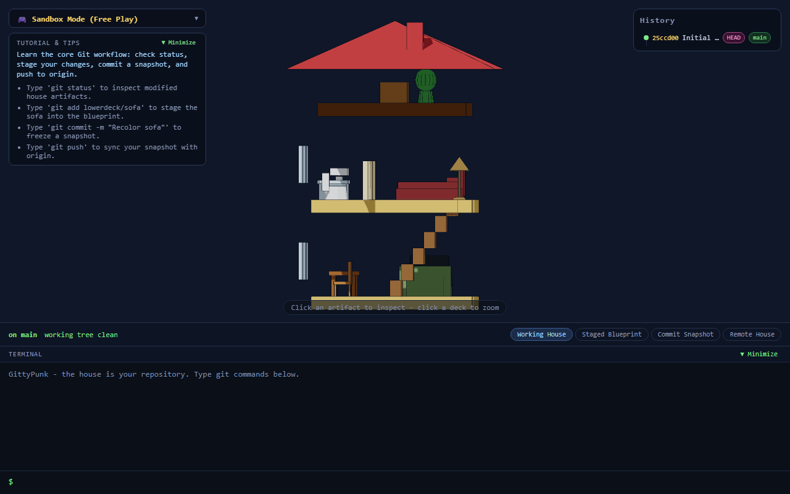

# GittyPunk

> A 3D isometric Git simulation game built with **Vite, React, TypeScript, and Three.js (React Three Fiber)**.  
> Every component and artifact in the house (roof, stairs, table, sofa, bed) has a Git identity — every Git command physically transforms the house.



## Overview

GittyPunk is an interactive, 100% offline Git simulation game where a Simpsons-inspired 3D isometric house **IS** your repository.

- **Zero Real-Git Dependency**: Commands maintain real-world Git syntax (`git push`, `git status`, `git commit -m`, `git restore -s HEAD`, `git reset --hard`) but are executed by an in-memory simulation engine in TypeScript.
- **Physical Transformations**: Staging, committing, resetting, merging, and purging rewrite the 3D house structure, furniture placement, and visual glows.

---

## Features

### 3D Spatial Visuals
- **Simpsons-Inspired Toon House**: 2-story bungalow with an attic directly under the roof, staircase, windows, bathroom dividers, and living room furniture.
- **Visual Git Overlays**:
  - **Yellow Glow**: Modified, unstaged artifacts in the working house.
  - **Blue Tint & Blueprint Shimmer**: Staged artifacts in the blueprint.
  - **Red Ghost & Deletion Marker**: Staged deletions.
  - **Purple Shimmer**: Untracked artifacts.
  - **Conflict Dual-Occupancy**: Local vs remote conflict versions occupying the same space with red fast shimmer.

### Time Travel & Side-by-Side Views
- **History Panel**: Vertical commit graph with branch tips (`main`, `feature`, `origin/main`), short shas, messages, and unpushed `↑` badges.
- **Time Travel**: Click any commit in history to rewind the 3D house to that exact architectural snapshot.
- **Side-by-Side Compare (`git diff`)**: Compare local vs remote or commit vs commit with ghost markers, 3D movement arrows, and line-by-line property diffs.
- **Remote House (`origin`) View**: Toggle between Working House, Staged Blueprint, Commit Snapshot, and Simulated Remote House (`origin`).

### Missions, Tutorial & Audio
- **6 Guided Missions & Interactive Tutorial**: Goal-driven scenarios auto-verified by a real-time checker (Clean tree, Remove roof, Rewind history, Resolve conflict, Backup day, Purge past).
- **Sandbox Free Play Mode**: Full command inventory with quick tutorial tips banner.
- **Web Audio Sound Synthesizer**: 100% offline retro sound effects (stage chime, commit freeze, push whoosh, conflict crunch, victory fanfare, confetti celebration).

### Camera & Terminal Controls
- **Blender-Style Controls**: Left drag to orbit, `Ctrl` + Left Drag or Middle/Right Drag to pan/move, scroll wheel to zoom in place.
- **Enhanced Terminal**: Command history (Up/Down arrows), `git --help` command reference, `clear`/`cls`, and a minimize toggle for maximum 3D view.

---

## Quick Start

### Prerequisites
- [Node.js](https://nodejs.org/) (v18 or higher)
- `npm`

### Installation & Run

```bash
# Clone the repository
git clone https://github.com/your-username/GittyPunk.git
cd GittyPunk

# Install dependencies
npm install

# Start the dev server
npm run dev
```

Open `http://localhost:5173/` in your browser.

---

## Project Architecture

```
GittyPunk/
├── src/
│   ├── engine/       # Pure in-memory Git simulation engine (no React/Three.js/DOM)
│   ├── parser/       # Command tokenizer, parser, and executor (depends only on engine)
│   ├── state/        # Zustand application store bridging engine and UI
│   ├── view/         # React Three Fiber 3D house renderer, surfaces, & compare view
│   ├── ui/           # Terminal, StatusBar, HistoryPanel, ComparePanel, MissionPanel
│   └── game/         # Missions, audio synthesizer, and progress checker
├── docs/             # Application screenshots and assets
└── LICENSE           # MIT License
```

---

## Testing & Verification

```bash
# Run unit & integration tests (218 tests)
npm test

# Run ESLint check
npm run lint

# Run TypeScript typecheck
npm run typecheck

# Production build
npm run build
```

---

## License

MIT License. See `LICENSE` for details.
